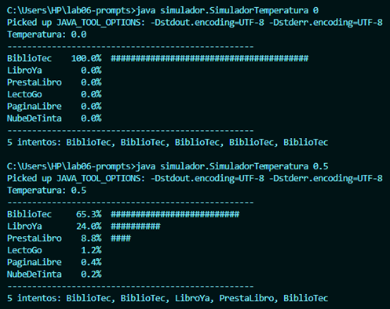
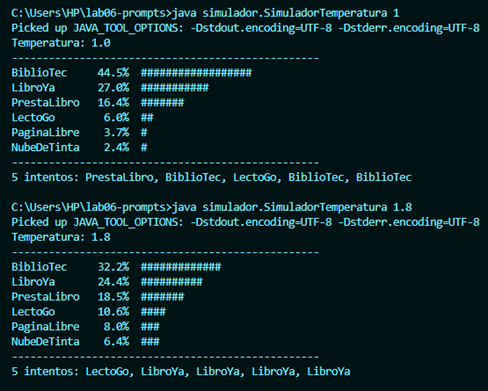
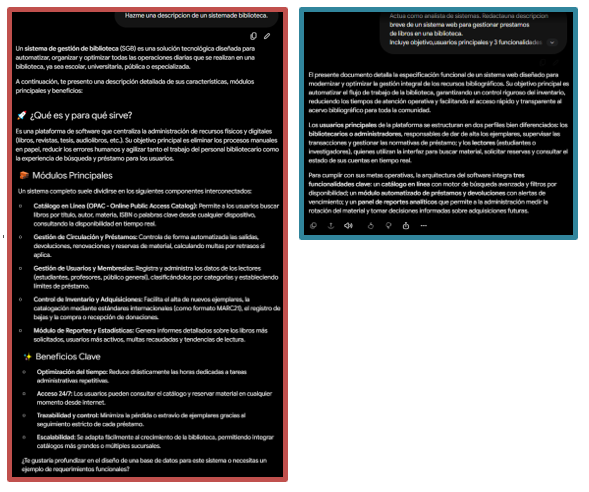

# Bitacora de prompts

Laboratorio 06: Fundamentos de Ingenieria de Prompts. 

Herramienta de IA usada: (escribe aqui cual usaste) 

## Ejercicio 2: Tokens y ventana de contexto

### Modelo GPT-5.x O1/3

|             **Texto**             |**Caracteres**| **Tokens** |
|-----------------------------------|--------------|------------|
| Los estudiantes programan en Java.|      38      |      8     |
| The students program in Java.     |      31      |      7     |
| desafortunadamente                |      19      |      5     |

### Comentario
En un chat al ofrecer información a la IA y preguntarle me responde correctamente puesto a que los datos que le escribí se guardan en su ventana de contexto, sin embargo si cambio a un nuevo chat y le escribo la misma pregunta que en la ventana inicial no me responde y me pide más información porque empieza en una ventana vacía.

## Ejercicio 3: Temperatura

| **Temperatura** | **% de BiblioTec** | **Nombres en los 5 intentos** |
|-----------------|--------------------|-------------------------------|
|        0        |        100%        |BiblioTec, BiblioTec, BiblioTec, BiblioTec, BiblioTec|
|       0.5       |        63.5%       |BiblioTec, BiblioTec, LibroYa, PrestaLibro, BiblioTec|
|        1        |        44.5%       |PrestaLibro, BiblioTec, LectoGo, BiblioTec, BiblioTec|
|       1.8       |        32.2%       |LectoGo, LibroYa, LibroYa, LibroYa, LibroYa|

### Comentario
Al subir la temperatura, los porcentajes se reparten y los intentos varían más. Además, el modelo no inventa nombres nuevos porque la temperatura solo cambia la creatividad al elegir entre lo que ya conoce.

### Captura de resultados



## Ejercicio 4: Prompt vago vs estructurado 

|             **Criterio**            | Prompt vago | Prompt estructurado |
|-------------------------------------|-------------|---------------------|
| Menciona el objetivo del sistema    |     No      |         Si          |
| Menciona a los usuarios principales |     No      |         Si          |
| Tiene exactamente 3 funcionalidades |     No      |         Si          |
| Esta en 3 parrafos                  |     No      |         Si          |
| Lo usaria en un informe real        |     No      |         Si          |

### Captura de resultados


## Ejercicio 5: Anatomia de un prompt

|**Componente** |                 **Text de mi prompt**             | 
|---------------|---------------------------------------------------|
|    **Rol**    |Actúa como desarrollador Java.|
|**Instrucción**|Crea un programa en Java, usando una clase Producto con los atributos codigo, nombre, precio y stock.|
|  **Contexto** |...para gestionar los productos de una tienda.|
|  **Ejemplo**  |Usa este estilo para los métodos: getPrecio(), setPrecio(double precio).|
|  **Formato**  |Explica primero la estructura de la clase y luego presenta el código Java.|

### Comentario
1. **Nivel 1:** Genera un código genérico básico sin enfoque específico.
2. **Nivel 2:** Adopta un rol técnico pero sigue siendo un programa general.
3. **Nivel 3:** Enfoca la utilidad del sistema específicamente a una tienda.
4. **Nivel 4:** Incorpora la clase `Producto` con sus atributos exactos.
5. **Nivel 5:** Estructura la explicación teórica y aplica el formato y ejemplo pedido.

## Ejercicio 6: Del prompt basico al profesional

### Prompt Profesional

|             **Preguntas**                              |**Cumple** (Si/No)|
|--------------------------------------------------------|------------------|
| ¿Está escrito en Java y usa Swing?                     |        Si        |
| ¿Pide correo y contraseña?                             |        Si        |
| ¿Explica el funcionamiento antes o después del código? |        Si        |
| ¿El código está organizado en clases?                  |        Si        |
| ¿Valida los datos que ingresa el usuario?              |        Si        |

### Ejemplo de prompt profesional + mejora
```text
Actua como desarrollador Java. Crea un ejemplo de login para una aplicacion de escritorio utilizando Swing. El usuario debe ingresar correo y contrasena. Explica brevemente el funcionamiento y presenta el codigo organizado por clases.

Mejora el codigo anterior con estas restricciones: no uses librerias externas, valida que el correo contenga @ y que la contrasena tenga al menos 8 caracteres, y muestra los mensajes con JOptionPane.
```
